# Flow maps

Diagrams of every path through Prompt Menu. They render on GitHub. Names in `code` are the real functions and types; see [ARCHITECTURE.md](ARCHITECTURE.md) for what each file owns.

- [The whole app at a glance](#the-whole-app-at-a-glance)

1. [App launch: Services or settings](#1-app-launch-services-or-settings)
2. [Service call to dialog](#2-service-call-to-dialog)
3. [The rewrite pipeline](#3-the-rewrite-pipeline)
4. [Choosing the runner and building the command](#4-choosing-the-runner-and-building-the-command)
5. [Running a program: streaming, timeout, failure](#5-running-a-program-streaming-timeout-failure)
6. [Cleaning the output](#6-cleaning-the-output)
7. [Dialog states](#7-dialog-states)
8. [Errors and what the user sees](#8-errors-and-what-the-user-sees)
9. [Settings: load, edit, save](#9-settings-load-edit-save)
10. [App lifetime: when it quits](#10-app-lifetime-when-it-quits)
11. [Install and registration](#11-install-and-registration)
12. [Development loop](#12-development-loop)
13. [Replace Selection](#13-replace-selection)
14. [Keeping the model loaded](#14-keeping-the-model-loaded)
15. [Applying an agentic pattern](#15-applying-an-agentic-pattern)
16. [Review: jury, then hardening](#16-review-jury-then-hardening)
17. [Explain This for Me](#17-explain-this-for-me)
18. [Follow-up chat](#18-follow-up-chat)
19. [Explain: what is this item?](#19-explain-what-is-this-item)
20. [Explain: reading a folder](#20-explain-reading-a-folder)
21. [Explain: reading a database](#21-explain-reading-a-database)
22. [Explain: several items at once](#22-explain-several-items-at-once)
23. [Privacy: where your data goes](#23-privacy-where-your-data-goes)

---

## The whole app at a glance

Every path starts with a right-click and ends with a result you control. Nothing runs before the click, and nothing stays running afterward except a kept-loaded MLX model, if that's turned on.

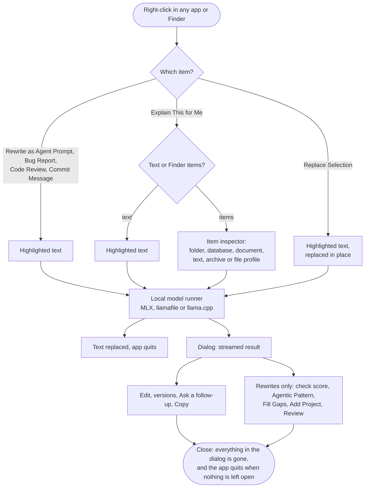
```mermaid
flowchart TD
    A(["Right-click in any app or Finder"]) --> B{"Which item?"}
    B -->|"Rewrite as Agent Prompt, Bug Report,<br/>Code Review, Commit Message"| C["Highlighted text"]
    B -->|"Replace Selection"| D["Highlighted text,<br/>replaced in place"]
    B -->|"Explain This for Me"| E{"Text or Finder items?"}
    E -->|text| F["Highlighted text"]
    E -->|items| G["Item inspector:<br/>folder, database, document,<br/>text, archive or file profile"]
    C & F & G --> H["Local model runner<br/>MLX, llamafile or llama.cpp"]
    D --> H
    H --> D2["Text replaced, app quits"]
    H --> I["Dialog: streamed result"]
    I --> J["Edit, versions, Ask a follow-up, Copy"]
    I --> K["Rewrites only: check score, Agentic Pattern,<br/>Fill Gaps, Add Project, Review"]
    J & K --> L(["Close: everything in the dialog is gone,<br/>and the app quits when nothing is left open"])
```

---

## 1. App launch: Services or settings

macOS starts the app when the Services item is chosen and it isn't already running. If no service request arrives within half a second, the user opened the app directly, so it shows settings.

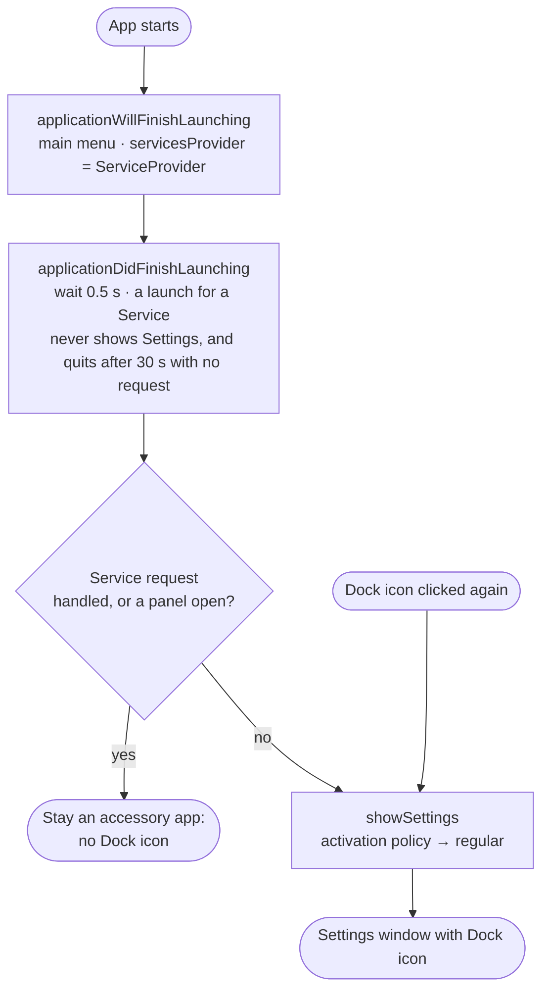
```mermaid
flowchart TD
    A([App starts]) --> B[applicationWillFinishLaunching<br/>main menu · servicesProvider = ServiceProvider]
    B --> C[applicationDidFinishLaunching<br/>wait 0.5 s · a launch for a Service<br/>never shows Settings, and quits after 30 s with no request]
    C --> D{Service request<br/>handled, or a panel open?}
    D -- yes --> E([Stay an accessory app:<br/>no Dock icon])
    D -- no --> F[showSettings<br/>activation policy → regular]
    F --> G([Settings window with Dock icon])
    H([Dock icon clicked again]) --> F
```

## 2. Service call to dialog

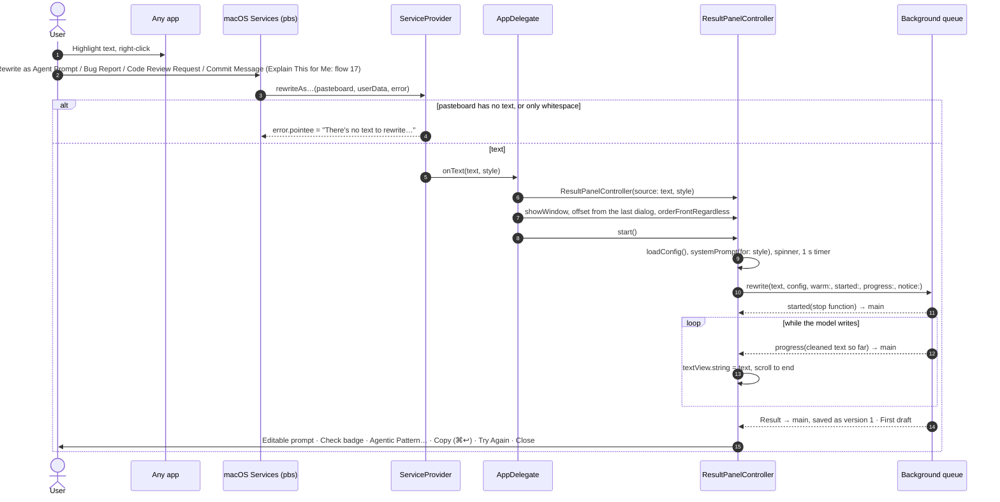
```mermaid
sequenceDiagram
    autonumber
    actor U as User
    participant App as Any app
    participant OS as macOS Services (pbs)
    participant SP as ServiceProvider
    participant AD as AppDelegate
    participant P as ResultPanelController
    participant BG as Background queue

    U->>App: Highlight text, right-click
    U->>OS: Services → Rewrite as Agent Prompt / Bug Report / Code Review Request / Commit Message (Explain This for Me: flow 17)
    OS->>SP: rewriteAs…(pasteboard, userData, error)
    alt pasteboard has no text, or only whitespace
        SP-->>OS: error.pointee = "There's no text to rewrite…"
    else text
        SP->>AD: onText(text, style)
        AD->>P: ResultPanelController(source: text, style)
        AD->>P: showWindow, offset from the last dialog, orderFrontRegardless
        AD->>P: start()
        P->>P: loadConfig(), systemPrompt(for: style), spinner, 1 s timer
        P->>BG: rewrite(text, config, warm:, started:, progress:, notice:)
        BG-->>P: started(stop function) → main
        loop while the model writes
            BG-->>P: progress(cleaned text so far) → main
            P->>P: textView.string = text, scroll to end
        end
        BG-->>P: Result → main, saved as version 1 · First draft
        P->>U: Editable prompt · Check badge · Agentic Pattern… · Copy (⌘↩) · Try Again · Close
    end
```

## 3. The rewrite pipeline

`rewrite(_:config:searchDirs:timeout:started:progress:)` in `Runner.swift` is the only entry point the UI uses.

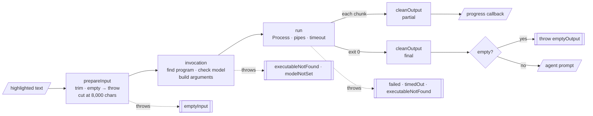
```mermaid
flowchart LR
    T[/highlighted text/] --> PI[prepareInput<br/>trim · empty → throw<br/>cut at 8,000 chars]
    PI --> INV[invocation<br/>find program · check model<br/>build arguments]
    INV --> RUN[run<br/>Process · pipes · timeout]
    RUN -- each chunk --> CO1[cleanOutput<br/>partial] --> PR[/progress callback/]
    RUN -- exit 0 --> CO2[cleanOutput<br/>final]
    CO2 --> E{empty?}
    E -- yes --> X1[[throw emptyOutput]]
    E -- no --> OUT[/agent prompt/]
    PI -. throws .-> X2[[emptyInput]]
    INV -. throws .-> X3[[executableNotFound · modelNotSet]]
    RUN -. throws .-> X4[[failed · timedOut · executableNotFound]]
```

## 4. Choosing the runner and building the command

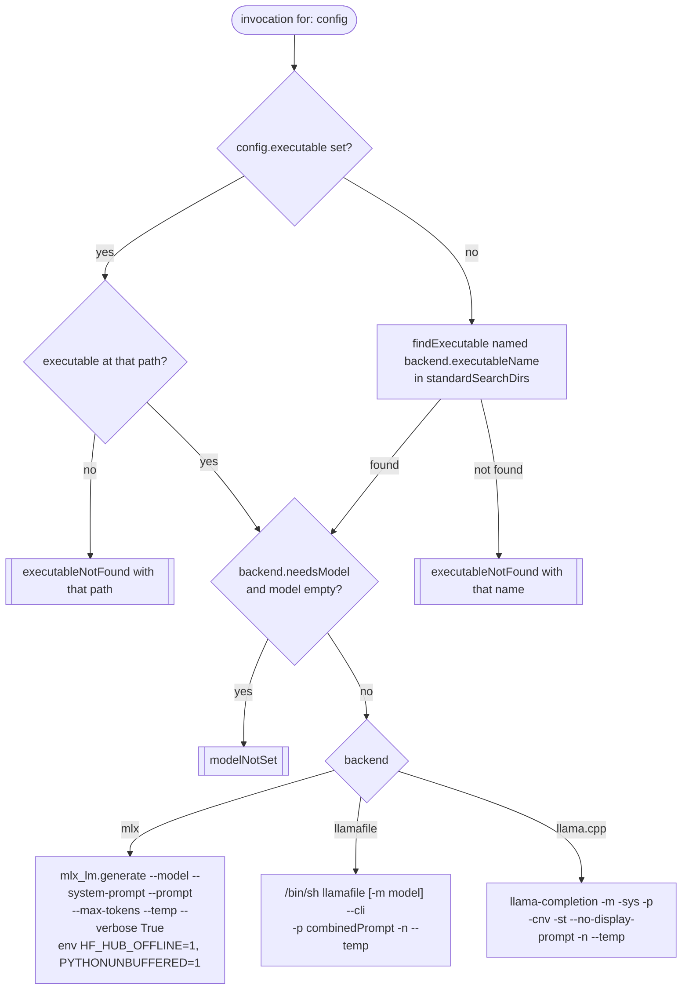
```mermaid
flowchart TD
    S([invocation for: config]) --> P{config.executable set?}
    P -- yes --> PX{executable at that path?}
    PX -- no --> E1[[executableNotFound with that path]]
    PX -- yes --> M
    P -- no --> F[findExecutable named backend.executableName<br/>in standardSearchDirs]
    F -- not found --> E2[[executableNotFound with that name]]
    F -- found --> M{backend.needsModel<br/>and model empty?}
    M -- yes --> E3[[modelNotSet]]
    M -- no --> B{backend}
    B -- mlx --> MLX["mlx_lm.generate --model --system-prompt --prompt<br/>--max-tokens --temp --verbose True<br/>env HF_HUB_OFFLINE=1, PYTHONUNBUFFERED=1"]
    B -- llamafile --> LF["/bin/sh llamafile [-m model] --cli<br/>-p combinedPrompt -n --temp"]
    B -- llama.cpp --> LC["llama-completion -m -sys -p<br/>-cnv -st --no-display-prompt -n --temp"]
```

Search order in `standardSearchDirs`: `/opt/homebrew/bin` → `/usr/local/bin` → `~/.local/bin` → `~/bin` → `~/Library/Python/*/bin` (newest first) → `$PATH`, without duplicates.

## 5. Running a program: streaming, timeout, failure

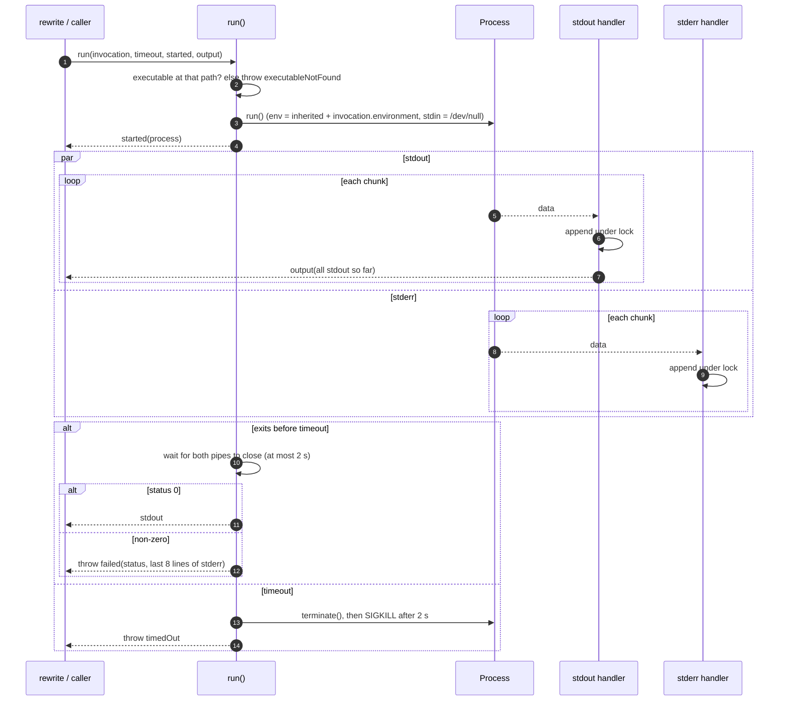
```mermaid
sequenceDiagram
    autonumber
    participant C as rewrite / caller
    participant R as run()
    participant P as Process
    participant O as stdout handler
    participant E as stderr handler

    C->>R: run(invocation, timeout, started, output)
    R->>R: executable at that path? else throw executableNotFound
    R->>P: run() (env = inherited + invocation.environment, stdin = /dev/null)
    R-->>C: started(process)
    par stdout
        loop each chunk
            P-->>O: data
            O->>O: append under lock
            O-->>C: output(all stdout so far)
        end
    and stderr
        loop each chunk
            P-->>E: data
            E->>E: append under lock
        end
    end
    alt exits before timeout
        R->>R: wait for both pipes to close (at most 2 s)
        alt status 0
            R-->>C: stdout
        else non-zero
            R-->>C: throw failed(status, last 8 lines of stderr)
        end
    else timeout
        R->>P: terminate(), then SIGKILL after 2 s
        R-->>C: throw timedOut
    end
```

The 2-second cap on waiting for the pipes covers a runner that leaves a child process holding stdout open. `testRunnerChildKeepsPipeOpen` tests it.

## 6. Cleaning the output

`cleanOutput` runs on every streamed chunk and again on the final text, so each step must also be safe on partial text.

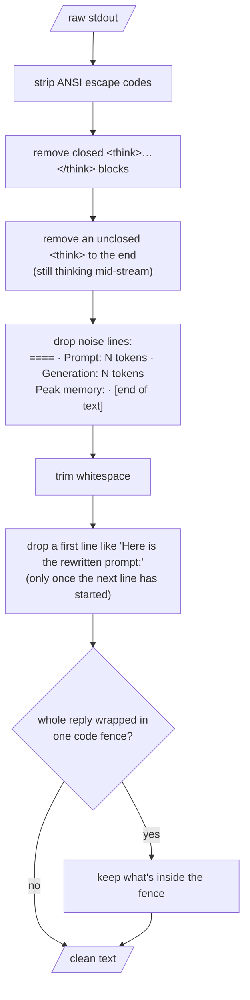
```mermaid
flowchart TD
    A[/raw stdout/] --> B[strip ANSI escape codes]
    B --> C["remove closed &lt;think&gt;…&lt;/think&gt; blocks"]
    C --> D["remove an unclosed &lt;think&gt; to the end<br/>(still thinking mid-stream)"]
    D --> E["drop noise lines:<br/>==== · Prompt: N tokens · Generation: N tokens<br/>Peak memory: · [end of text]"]
    E --> F[trim whitespace]
    F --> P["drop a first line like 'Here is the rewritten prompt:'<br/>(only once the next line has started)"]
    P --> G{whole reply wrapped in<br/>one code fence?}
    G -- yes --> H[keep what's inside the fence]
    G -- no --> I[/clean text/]
    H --> I
```

## 7. Dialog states

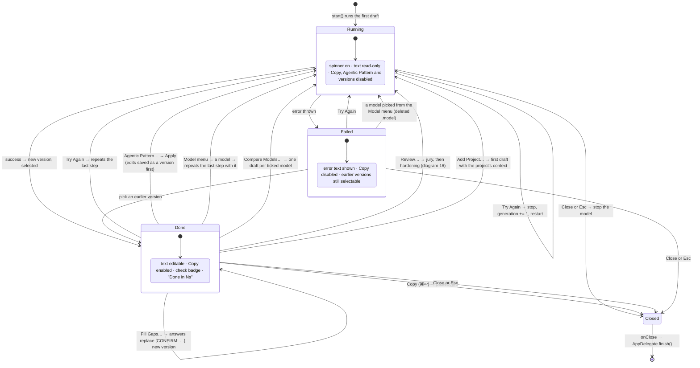
```mermaid
stateDiagram-v2
    [*] --> Running: start() runs the first draft
    Running --> Running: progress → text streams in<br/>timer ticks every 1 s
    Running --> Done: success → new version, selected
    Running --> Failed: error thrown
    Running --> Closed: Close or Esc → stop the model
    Done --> Running: Try Again → repeats the last step
    Failed --> Running: Try Again
    Running --> Running: Try Again → stop, generation += 1, restart
    Done --> Done: edit text → check badge updates
    Done --> Done: pick a version → its text and check
    Done --> Running: Agentic Pattern… → Apply<br/>(edits saved as a version first)
    Done --> Running: Model menu → a model → repeats the last step with it
    Done --> Running: Compare Models… → one draft per ticked model
    Done --> Running: Review… → jury, then hardening (diagram 16)
    Done --> Running: Add Project… → first draft with the project's context
    Done --> Done: Fill Gaps… → answers replace [CONFIRM: …], new version
    Failed --> Running: a model picked from the Model menu (deleted model)
    Failed --> Done: pick an earlier version
    Done --> Closed: Copy (⌘↩) → pasteboard
    Done --> Closed: Close or Esc
    Failed --> Closed: Close or Esc
    Closed --> [*]: onClose → AppDelegate.finish()

    state Running {
        [*] --> spinner_on
        spinner_on: spinner on · text read-only · Copy, Agentic Pattern and versions disabled
    }
    state Done {
        [*] --> editable
        editable: text editable · Copy enabled · check badge · "Done in Ns"
    }
    state Failed {
        [*] --> message
        message: error text shown · Copy disabled · earlier versions still selectable
    }
```

## 8. Errors and what the user sees

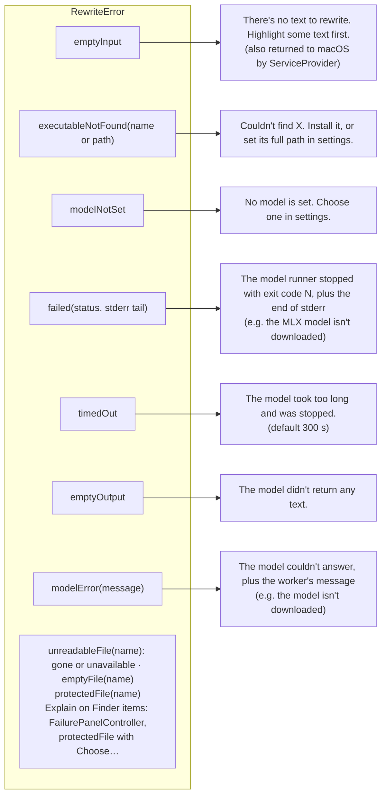
```mermaid
flowchart LR
    subgraph Thrown["RewriteError"]
        A[emptyInput]
        B["executableNotFound(name or path)"]
        C[modelNotSet]
        D["failed(status, stderr tail)"]
        E[timedOut]
        F[emptyOutput]
        G["modelError(message)"]
        U2["unreadableFile(name): gone or unavailable · emptyFile(name)<br/>protectedFile(name)<br/>Explain on Finder items: FailurePanelController,<br/>protectedFile with Choose…"]
    end
    A --> A1["There's no text to rewrite. Highlight some text first.<br/>(also returned to macOS by ServiceProvider)"]
    B --> B1["Couldn't find X. Install it, or set its full path in settings."]
    C --> C1["No model is set. Choose one in settings."]
    D --> D1["The model runner stopped with exit code N, plus the end of stderr<br/>(e.g. the MLX model isn't downloaded)"]
    E --> E1["The model took too long and was stopped.<br/>(default 300 s)"]
    F --> F1["The model didn't return any text."]
    G --> G1["The model couldn't answer, plus the worker's message<br/>(e.g. the model isn't downloaded)"]
```

All of these appear in the dialog's text area with Copy turned off. Try Again re-reads the settings, so you can fix the setting and retry without closing the dialog.

## 9. Settings: load, edit, save

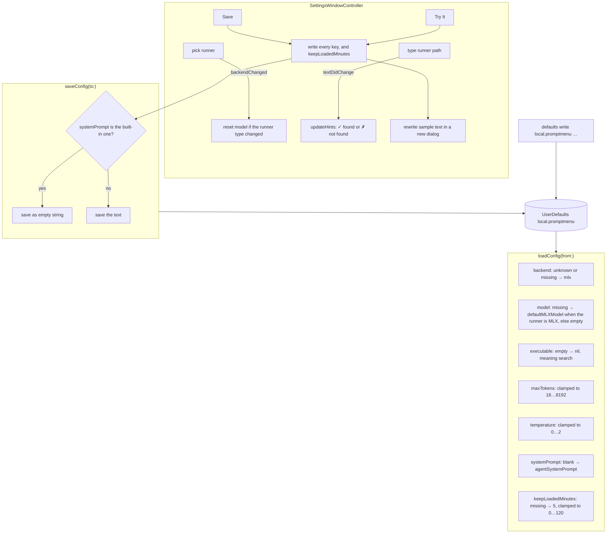
```mermaid
flowchart TD
    subgraph Load["loadConfig(from:)"]
        L1[backend: unknown or missing → mlx]
        L2[model: missing → defaultMLXModel when the runner is MLX, else empty]
        L3[executable: empty → nil, meaning search]
        L4[maxTokens: clamped to 16…8192]
        L5[temperature: clamped to 0…2]
        L6[systemPrompt: blank → agentSystemPrompt]
        L7[keepLoadedMinutes: missing → 5, clamped to 0…120]
    end
    subgraph Window["SettingsWindowController"]
        W1[pick runner] -->|backendChanged| W2[reset model if the runner type changed]
        W3[type runner path] -->|textDidChange| W4["updateHints: ✓ found or ✗ not found"]
        W5[Save] --> SV
        W6[Try It] --> SV --> T[rewrite sample text in a new dialog]
    end
    subgraph Save["saveConfig(to:)"]
        SV[write every key, and keepLoadedMinutes] --> SP{systemPrompt is the built-in one?}
        SP -- yes --> SP1[save as empty string]
        SP -- no --> SP2[save the text]
    end
    DEF[(UserDefaults local.promptmenu)] --> Load
    Save --> DEF
    CLI["defaults write local.promptmenu …"] --> DEF
```

## 10. App lifetime: when it quits

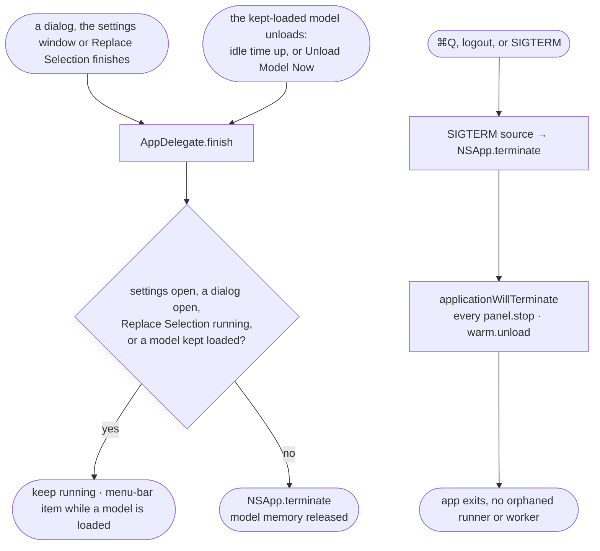
```mermaid
flowchart TD
    A([a dialog, the settings window or Replace Selection finishes]) --> B[AppDelegate.finish]
    U([the kept-loaded model unloads:<br/>idle time up, or Unload Model Now]) --> B
    B --> C{settings open, a dialog open,<br/>Replace Selection running,<br/>or a model kept loaded?}
    C -- yes --> D([keep running · menu-bar item while a model is loaded])
    C -- no --> E([NSApp.terminate<br/>model memory released])
    Q([⌘Q, logout, or SIGTERM]) --> S[SIGTERM source → NSApp.terminate]
    S --> W[applicationWillTerminate<br/>every panel.stop · warm.unload]
    W --> X([app exits, no orphaned runner or worker])
```

## 11. Install and registration

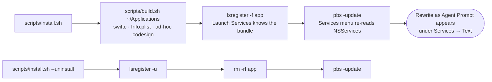
```mermaid
flowchart LR
    A[scripts/install.sh] --> B["scripts/build.sh ~/Applications<br/>swiftc · Info.plist · ad-hoc codesign"]
    B --> C["lsregister -f app<br/>Launch Services knows the bundle"]
    C --> D["pbs -update<br/>Services menu re-reads NSServices"]
    D --> E([Rewrite as Agent Prompt appears<br/>under Services → Text])
    U["scripts/install.sh --uninstall"] --> U1["lsregister -u"] --> U2["rm -rf app"] --> U3["pbs -update"]
```

## 12. Development loop

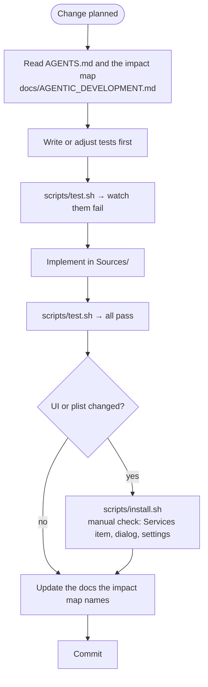
```mermaid
flowchart TD
    A([Change planned]) --> B[Read AGENTS.md and the impact map<br/>docs/AGENTIC_DEVELOPMENT.md]
    B --> C[Write or adjust tests first]
    C --> D[scripts/test.sh → watch them fail]
    D --> E[Implement in Sources/]
    E --> F[scripts/test.sh → all pass]
    F --> G{UI or plist changed?}
    G -- yes --> H[scripts/install.sh<br/>manual check: Services item, dialog, settings]
    G -- no --> I
    H --> I[Update the docs the impact map names]
    I --> J[Commit]
```

## 13. Replace Selection

**Rewrite as Agent Prompt (Replace Selection)** returns the prompt to the app that asked, in place of the highlighted text. That app waits until the answer comes back, up to `NSTimeout` (120 s); Prompt Menu gives up at `inPlaceTimeout` (110 s) so the error arrives first.

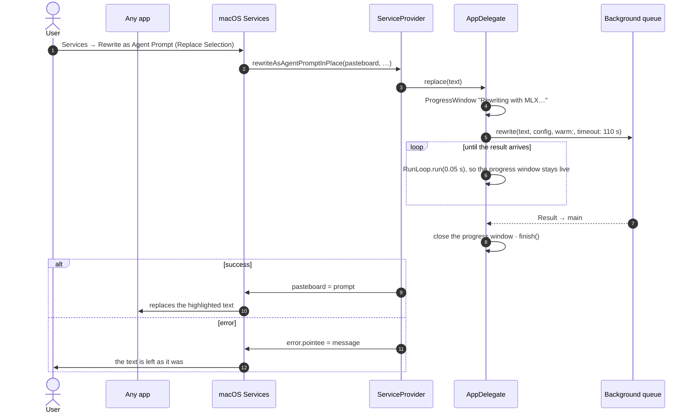
```mermaid
sequenceDiagram
    autonumber
    actor U as User
    participant App as Any app
    participant OS as macOS Services
    participant SP as ServiceProvider
    participant AD as AppDelegate
    participant BG as Background queue

    U->>OS: Services → Rewrite as Agent Prompt (Replace Selection)
    OS->>SP: rewriteAsAgentPromptInPlace(pasteboard, …)
    SP->>AD: replace(text)
    AD->>AD: ProgressWindow "Rewriting with MLX…"
    AD->>BG: rewrite(text, config, warm:, timeout: 110 s)
    loop until the result arrives
        AD->>AD: RunLoop.run(0.05 s), so the progress window stays live
    end
    BG-->>AD: Result → main
    AD->>AD: close the progress window · finish()
    alt success
        SP->>OS: pasteboard = prompt
        OS->>App: replaces the highlighted text
    else error
        SP->>OS: error.pointee = message
        OS->>U: the text is left as it was
    end
```

## 14. Keeping the model loaded

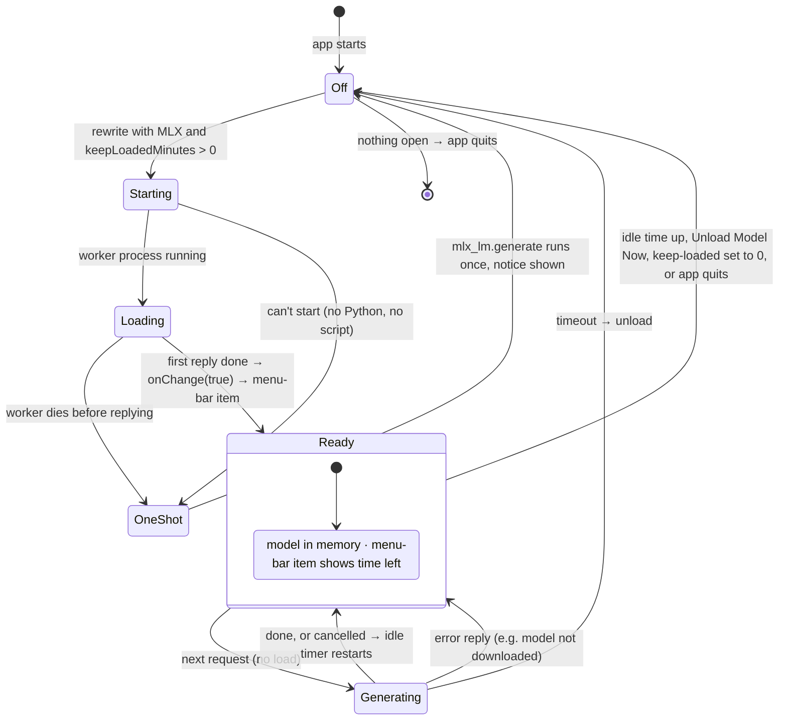
```mermaid
stateDiagram-v2
    [*] --> Off: app starts
    Off --> Starting: rewrite with MLX and keepLoadedMinutes > 0
    Starting --> Loading: worker process running
    Starting --> OneShot: can't start (no Python, no script)
    Loading --> Ready: first reply done → onChange(true) → menu-bar item
    Loading --> OneShot: worker dies before replying
    Ready --> Generating: next request (no load)
    Generating --> Ready: done, or cancelled → idle timer restarts
    Generating --> Ready: error reply (e.g. model not downloaded)
    Generating --> Off: timeout → unload
    Ready --> Off: idle time up, Unload Model Now, keep-loaded set to 0, or app quits
    Off --> [*]: nothing open → app quits
    OneShot --> Off: mlx_lm.generate runs once, notice shown

    state Ready {
        [*] --> loaded
        loaded: model in memory · menu-bar item shows time left
    }
```

The worker exits when its stdin closes, so it can't outlive the app even if the app crashes.

## 15. Applying an agentic pattern

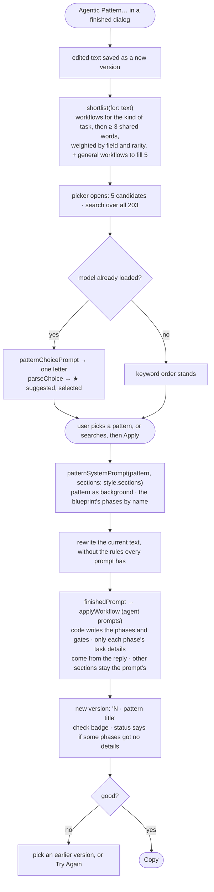
```mermaid
flowchart TD
    A([Agentic Pattern… in a finished dialog]) --> B[edited text saved as a new version]
    B --> C["shortlist(for: text)<br/>workflows for the kind of task, then ≥ 3 shared words,<br/>weighted by field and rarity, + general workflows to fill 5"]
    C --> D[picker opens: 5 candidates · search over all 203]
    D --> E{model already loaded?}
    E -- yes --> F["patternChoicePrompt → one letter<br/>parseChoice → ★ suggested, selected"]
    E -- no --> G[keyword order stands]
    F --> H
    G --> H([user picks a pattern, or searches, then Apply])
    H --> I["patternSystemPrompt(pattern, sections: style.sections)<br/>pattern as background · the blueprint's phases by name"]
    I --> J[rewrite the current text, without the rules every prompt has]
    J --> J2["finishedPrompt → applyWorkflow (agent prompts)<br/>code writes the phases and gates · only each phase's task details<br/>come from the reply · other sections stay the prompt's"]
    J2 --> K[new version: 'N · pattern title'<br/>check badge · status says if some phases got no details]
    K --> L{good?}
    L -- no --> M[pick an earlier version, or Try Again]
    L -- yes --> N([Copy])
```

## 16. Review: jury, then hardening

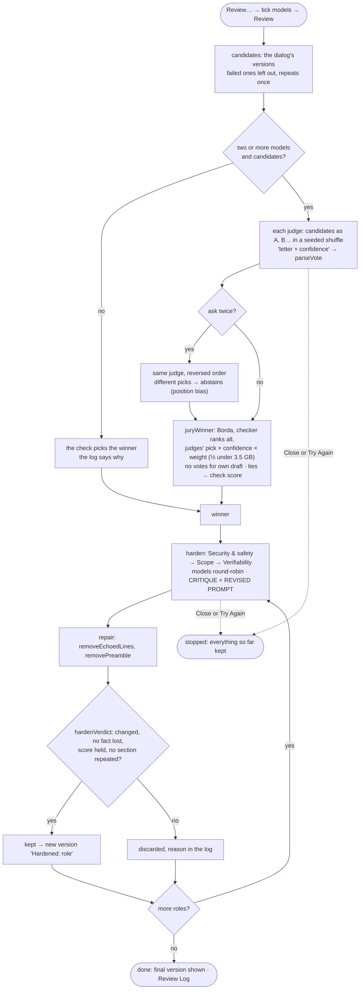
```mermaid
flowchart TD
    A([Review… → tick models → Review]) --> B[candidates: the dialog's versions<br/>failed ones left out, repeats once]
    B --> C{two or more models<br/>and candidates?}
    C -- no --> D[the check picks the winner<br/>the log says why]
    C -- yes --> E["each judge: candidates as A, B… in a seeded shuffle<br/>'letter + confidence' → parseVote"]
    E --> F{ask twice?}
    F -- yes --> G["same judge, reversed order<br/>different picks → abstains (position bias)"]
    F -- no --> H
    G --> H["juryWinner: Borda, checker ranks all,<br/>judges' pick × confidence × weight (½ under 3.5 GB)<br/>no votes for own draft · ties → check score"]
    D --> I
    H --> I[winner]
    I --> J["harden: Security & safety → Scope → Verifiability<br/>models round-robin · CRITIQUE + REVISED PROMPT"]
    J --> K["repair: removeEchoedLines, removePreamble"]
    K --> L{"hardenVerdict: changed, no fact lost,<br/>score held, no section repeated?"}
    L -- yes --> M[kept → new version 'Hardened: role']
    L -- no --> N[discarded, reason in the log]
    M --> O{more roles?}
    N --> O
    O -- yes --> J
    O -- no --> P([done: final version shown · Review Log])
    E -. Close or Try Again .-> Q([stopped: everything so far kept])
    J -. Close or Try Again .-> Q
```

State machine (`ReviewMachine`): `candidates → judging → hardening(0) → hardening(1) → hardening(2) → done`, and `stopped` from any step before `done`. Any other move is rejected.

## 17. Explain This for Me

The sixth Services item. It accepts highlighted text, like the others, and also any file or folder right-clicked in Finder (`NSSendFileTypes` includes `public.item`). Only what the user picked is read, up to `maxInputCharacters` in total, and nothing is written. Flows 19 to 22 show how each kind of item becomes text.

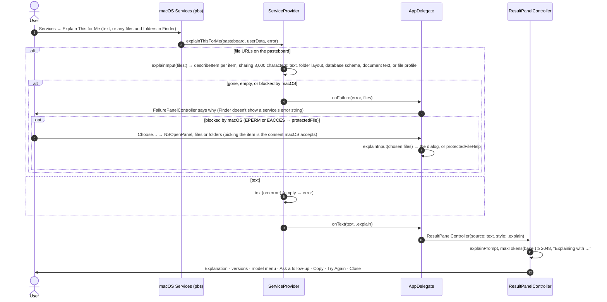
```mermaid
sequenceDiagram
    autonumber
    actor U as User
    participant OS as macOS Services (pbs)
    participant SP as ServiceProvider
    participant AD as AppDelegate
    participant P as ResultPanelController

    U->>OS: Services → Explain This for Me (text, or any files and folders in Finder)
    OS->>SP: explainThisForMe(pasteboard, userData, error)
    alt file URLs on the pasteboard
        SP->>SP: explainInput(files:) → describeItem per item, sharing 8,000 characters: text, folder layout, database schema, document text, or file profile
        alt gone, empty, or blocked by macOS
            SP->>AD: onFailure(error, files)
            AD->>U: FailurePanelController says why (Finder doesn't show a service's error string)
            opt blocked by macOS (EPERM or EACCES → protectedFile)
                U->>AD: Choose… → NSOpenPanel, files or folders (picking the item is the consent macOS accepts)
                AD->>AD: explainInput(chosen files) → the dialog, or protectedFileHelp
            end
        end
    else text
        SP->>SP: text(on:error:) (empty → error)
    end
    SP->>AD: onText(text, .explain)
    AD->>P: ResultPanelController(source: text, style: .explain)
    P->>P: explainPrompt, maxTokens(base:) ≥ 2048, "Explaining with …"
    P->>U: Explanation · versions · model menu · Ask a follow-up · Copy · Try Again · Close
```

A launch for a Service never opens Settings (`showsSettingsAtLaunch`, from `NSApplication.launchIsDefaultUserInfoKey`); with no request after 30 seconds, the app quits.

The pattern, Fill Gaps, Add Project and check controls, and Review… and Review Log in the model menu, are hidden, because `Style.explain.isRewrite` is false; Review judges and hardens agent prompts. Compare Models stays, and its versions carry no check score. With llamafile the text is labelled "Text to explain".

## 18. Follow-up chat

Under the result in every dialog, shown once the first result is in.

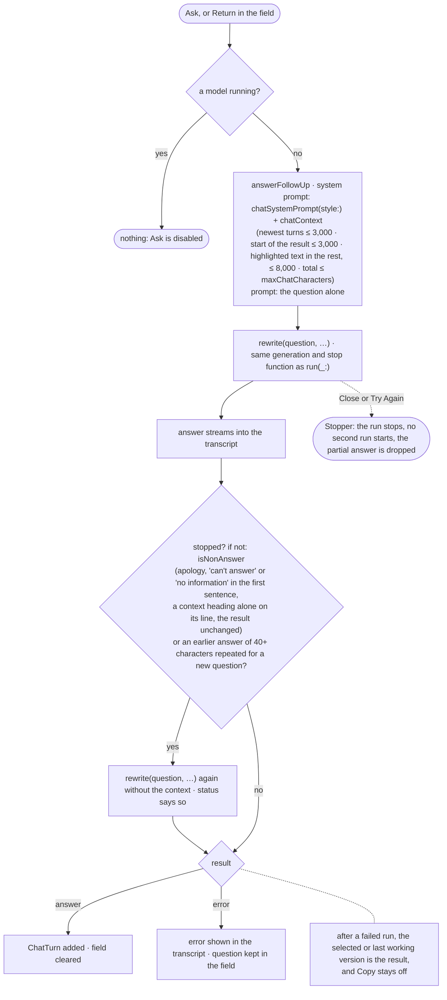
```mermaid
flowchart TD
    A([Ask, or Return in the field]) --> B{a model running?}
    B -- yes --> Z([nothing: Ask is disabled])
    B -- no --> C["answerFollowUp · system prompt: chatSystemPrompt(style:) + chatContext<br/>(newest turns ≤ 3,000 · start of the result ≤ 3,000 · highlighted text in the rest, ≤ 8,000 · total ≤ maxChatCharacters)<br/>prompt: the question alone"]
    C --> D["rewrite(question, …) · same generation and stop function as run(_:)"]
    D --> E[answer streams into the transcript]
    E --> X{"stopped? if not: isNonAnswer<br/>(apology, 'can't answer' or 'no information' in the first sentence,<br/>a context heading alone on its line, the result unchanged)<br/>or an earlier answer of 40+ characters repeated for a new question?"}
    X -- yes --> Y["rewrite(question, …) again without the context · status says so"]
    Y --> F
    X -- no --> F{result}
    F -- answer --> G[ChatTurn added · field cleared]
    F -- error --> H[error shown in the transcript · question kept in the field]
    F -.- K[after a failed run, the selected or last working version is the result,<br/>and Copy stays off]
    D -. Close or Try Again .-> I([Stopper: the run stops, no second run starts, the partial answer is dropped])
```

The turns are kept in the dialog only. Closing it forgets them.

## 19. Explain: what is this item?

`describeItem` in `Sources/Core/ItemDescription.swift`. The answer comes from the item's contents, so a file's name can't mislead it. Each reader that can't cope falls through to the next, and the last one always has something to say.

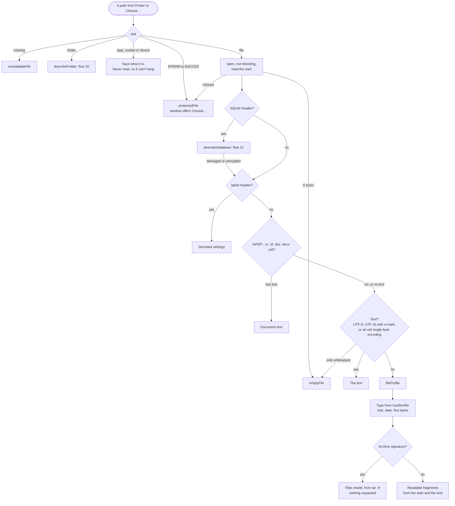
```mermaid
flowchart TD
    A(["A path from Finder or Choose…"]) --> B{"stat"}
    B -->|"EPERM or EACCES"| P["protectedFile<br/>window offers Choose…"]
    B -->|"missing"| U["unreadableFile"]
    B -->|folder| F["describeFolder: flow 20"]
    B -->|"pipe, socket or device"| S["Says what it is.<br/>Never read, so it can't hang"]
    B -->|file| C["open, non-blocking,<br/>read the start"]
    C -->|refused| P
    C -->|"0 bytes"| E["emptyFile"]
    C --> D{"SQLite header?"}
    D -->|yes| DB["describeDatabase: flow 21"]
    DB -->|"damaged or encrypted"| PL
    D -->|no| PL{"bplist header?"}
    PL -->|yes| PD["Decoded settings"]
    PL -->|no| DOC{"%PDF-, or .rtf .doc .docx .odt?"}
    DOC -->|"has text"| DT["Document text"]
    DOC -->|"no, or no text"| T{"Text?<br/>UTF-8, UTF-16 with a mark,<br/>or an old single-byte encoding"}
    T -->|yes| TT["The text"]
    T -->|"only whitespace"| E
    T -->|no| Z["fileProfile"]
    Z --> Z1["Type from /usr/bin/file<br/>size, date, first bytes"]
    Z1 --> Z2{"Archive signature?"}
    Z2 -->|yes| Z3["Files inside, from tar -tf<br/>nothing unpacked"]
    Z2 -->|no| Z4["Readable fragments<br/>from the start and the end"]
```

## 20. Explain: reading a folder

`describeFolder`. Breadth first, so running out of time still leaves the top of the folder, which says the most. The description has three parts: a summary, the layout, and samples of the files that say what the folder is.

```mermaid
flowchart TD
    A(["A folder"]) --> B{"List it"}
    B -->|refused| P["protectedFile: Choose…"]
    B -->|"nothing but .DS_Store"| E["emptyFile"]
    B --> C["Walk breadth first with lstat"]
    C --> D{"Each entry"}
    D -->|"link"| D1["Listed as name -> target<br/>never followed"]
    D -->|".git, node_modules, build…"| D2["Listed, contents not walked"]
    D -->|"folder macOS blocks"| D3["Listed as blocked, walk continues"]
    D -->|"other folder"| C
    D -->|"file"| D4["Counted: size, type, date"]
    C -->|"2 s or 20,000 entries"| S["Stopped early:<br/>the summary says so"]
    D1 & D2 & D3 & D4 & S --> SUM["Summary: totals, common types,<br/>largest and newest files"]
    SUM --> LAY["Layout: 30 entries per folder,<br/>levels drop from 5 until it fits"]
    LAY --> PICK["Candidates at most two levels down, up to 1 MB:<br/>README, manifests and similar first, then newest"]
    PICK --> SKIP{"Safe to open?"}
    SKIP -->|"secret-looking name, online-only,<br/>or contains a private key"| NO["Name stays in the layout,<br/>contents stay out"]
    SKIP -->|yes| YES["Start of the file, up to 4 files"]
    NO & YES --> OUT(["Folder: name, then summary, layout and samples,<br/>cut to its share"])
```

## 21. Explain: reading a database

`describeDatabase`. Any file with SQLite's header, whatever its name. The database isn't changed, and no files appear beside it.

```mermaid
sequenceDiagram
    autonumber
    participant I as describeItem
    participant D as describeDatabase
    participant S as SQLite library

    I->>D: path, name, size, limit
    D->>S: open read-only with immutable=1
    Note over D,S: No locks, journal or -wal files
    D->>S: progress handler enforcing the time limits (3 s total)
    D->>S: PRAGMA trusted_schema=OFF
    D->>S: read sqlite_master
    alt damaged or not really SQLite
        S-->>D: error
        D-->>I: nil, so the file goes to the next reader (flow 19)
    else readable
        S-->>D: tables, views, indexes, triggers
        loop each table, 0.3 s per query
            D->>S: SELECT COUNT(*)
        end
        Note over D: Biggest tables first
        loop each table, until the limit is near
            D->>S: PRAGMA table_info
            D->>S: SELECT * LIMIT 3
            Note over D: Secret-looking columns become (hidden), blobs become N-byte blob, values stop at 80 characters
        end
        D-->>I: Database: name, tables, columns, samples, views and triggers
    end
```

## 22. Explain: several items at once

`explainInput(files:)`. Items share the limit, so a big first file can't crowd out the rest, and one bad item doesn't lose the others.

```mermaid
flowchart TD
    A(["Selection"]) --> B["First 20 items are described.<br/>Space is reserved to name the rest"]
    B --> C["Next item's share:<br/>space left ÷ items left"]
    C --> D{"describeItem"}
    D -->|ok| E["Add its description.<br/>Unused space passes to later items"]
    D -->|protectedFile| P(["Stop: window offers Choose…,<br/>which can grant the whole selection"])
    D -->|"other failure, one item selected"| X(["Window says why"])
    D -->|"other failure, several selected"| F["Add a note that it couldn't be read"]
    E & F --> G{"More items?"}
    G -->|yes| C
    G -->|no| H{"Did any item work?"}
    H -->|no| X
    H -->|yes| I(["Everything joined, plus the names of<br/>items not looked at, within 8,000 characters"])
```

## 23. Privacy: where your data goes

Everything stays on this Mac. The dashed line is what the app doesn't have: `testNoNetworkCode` fails the build if networking APIs or URLs appear in `Sources/`, or if the worker script has network or download calls.

```mermaid
flowchart LR
    subgraph Mac["This Mac"]
        A["Highlighted text"] --> P["Prompt Menu"]
        B["Files and folders you chose,<br/>read-only"] --> P
        P -->|"one-shot runner: one command-line argument"| R["Runner, exits after each run"]
        P -->|"kept-loaded MLX: private pipe"| W["Worker, exits with the app"]
        R & W --> D["Dialog: versions, chat, Review Log<br/>in memory, gone on close"]
        P -->|"settings only, never your text"| S[("UserDefaults")]
        M[("Models already on disk")] --> R & W
    end
    P -. "no network code" .-x I(("Internet"))
```

| What | Where it goes | How long it lasts |
|---|---|---|
| Highlighted text | The app, then the model runner | Until the dialog closes |
| Chosen files and folders | Read-only, sampled into the same input | Until the dialog closes. The originals aren't changed |
| The model's output, versions, chat, Review Log | The dialog's memory | Until the dialog closes |
| Settings (runner, model, prompts) | `UserDefaults`, domain `local.promptmenu` | Until you change them |
| Anything sent to a server by Prompt Menu | Nothing: there's no code that could | Not applicable |

The limits of these promises, such as a command-line argument being visible to other processes under your account while a run is active, are listed in the [README's privacy section](../README.md#privacy).
